<div align="center">



### FULL STACK DEVELOPER · SYSTEM ONLINE

`RUST` / `REACT` / `MYSQL` / `DOCKER` / `KUBERNETES` / `LINUX`

**From interface to infrastructure.**

</div>

---

### `01` // OPERATOR

```text
┌─ j0xcore@github ─────────────────────────────┐
│  NAME     Chainuwat Ruengsri                 │
│  ROLE     Full Stack Developer               │
│  CORE     Rust + React                       │
│  DATA     MySQL                              │
│  DEPLOY   Docker + Kubernetes                │
│  SYSTEM   Linux                              │
└──────────────────────────────────────────────┘
```

### `02` // TECH ARSENAL

<p align="center">
  
  
  
  
  
  
</p>

---

<div align="center">

**`[ BUILD ]` → `[ SHIP ]` → `[ ITERATE ]`**

<sub>J0XCORE // END OF TRANSMISSION_</sub>

</div>
